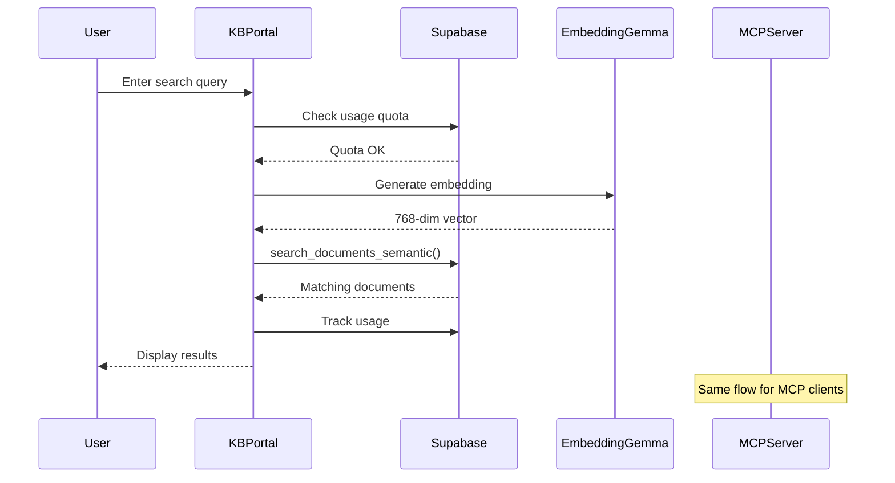
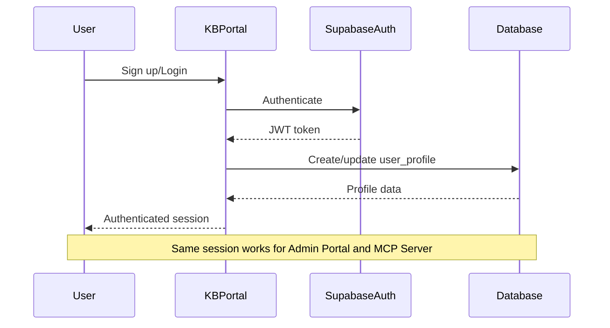

# KB Portal Integration Architecture

## Overview

This document describes the integration architecture between the KB Portal and the main NABLA system, ensuring seamless data sharing, authentication, and user experience across both platforms.

## Shared Infrastructure

### 1. Supabase Database (Shared)

Both KB Portal and KB MCP Server share the same Supabase instance and database:

**Connection Details:**
- URL: `NEXT_PUBLIC_SUPABASE_URL`
- Service Key: `SUPABASE_SERVICE_ROLE_KEY`
- Anon Key: `NEXT_PUBLIC_SUPABASE_ANON_KEY`

**Shared Tables:**
- `documents` - Knowledge base documents with 768-dim embeddings
- `auth.users` - Supabase authentication users
- `user_profiles` - Extended user profile information
- `tier_limits` - Subscription tier configurations
- `usage_tracking` - Usage statistics and quota management
- `audit_log` - System-wide audit trail

### 2. EmbeddingGemma Service (Shared)

Both systems use the same EmbeddingGemma service deployed on Railway:

**Configuration:**
- Service URL: `EMBEDDING_SERVICE_URL`
- Model: EmbeddingGemma 768-dimensional
- Endpoint: `/embed` for single text, `/embed/batch` for batch processing

**Integration Points:**
- KB Portal: Uses for search query embeddings
- KB MCP Server: Uses for document ingestion and search
- Admin Portal: Uses for content validation and similarity matching

### 3. Authentication System (Unified)

**Supabase Auth Integration:**
- Single Sign-On (SSO) across all portals
- OAuth providers: Google, Microsoft Azure
- 2FA support with TOTP
- Session management with JWT tokens

**User Flow:**
1. User signs up/logs in via KB Portal
2. Profile created in `user_profiles` table
3. Same credentials work for:
   - KB Portal (web interface)
   - Admin Portal (if authorized)
   - MCP Server (via API keys)

### 4. Tier System (Synchronized)

**Tier Definitions:**
```typescript
enum UserTier {
  FREE = 'free',
  PRO = 'pro',
  ENTERPRISE = 'enterprise'
}

enum MCPTier {
  FREE = 'free',
  PRO = 'pro',
  BASIC_AI = 'basic_ai',
  PRO_AI = 'pro_ai',
  ENTERPRISE = 'enterprise',
  ENTERPRISE_PLUS = 'enterprise_plus'
}
```

**Tier Mapping:**
- KB Portal `free` → MCP Server `free`
- KB Portal `pro` → MCP Server `pro` or `basic_ai`
- KB Portal `enterprise` → MCP Server `enterprise` or `enterprise_plus`

## Integration Points

### 1. Document Access

**Shared Document Repository:**
```sql
-- Both systems query the same documents table
SELECT * FROM documents 
WHERE embedding IS NOT NULL
ORDER BY created_at DESC;
```

**Consistency Guarantees:**
- Documents added via Admin Portal are immediately available in KB Portal
- Documents added via MCP Server are immediately available in KB Portal
- Embeddings generated once and shared across all systems
- No data duplication or synchronization lag

### 2. Search Functionality

**Semantic Search (Shared Function):**
```sql
-- Both systems use the same pgvector search function
SELECT * FROM search_documents_semantic(
  query_embedding := $1,
  match_threshold := 0.7,
  match_count := 20
);
```

**Search Flow:**
1. User enters query in KB Portal or MCP client
2. Query sent to EmbeddingGemma service
3. 768-dim embedding generated
4. pgvector similarity search executed
5. Results returned with relevance scores
6. Usage tracked in `usage_tracking` table

### 3. User Authentication

**Authentication Flow:**
```typescript
// KB Portal
const { user } = await authService.signIn({ email, password });

// MCP Server (API Key)
const apiKey = await generateAPIKey(user.id, tier);

// Admin Portal
const { user } = await adminAuthService.signIn({ email, password, require2FA: true });
```

**Session Management:**
- JWT tokens issued by Supabase Auth
- Tokens valid across all portals
- Refresh tokens handled automatically
- Session expiry: 1 hour (configurable)

### 4. Usage Tracking

**Unified Usage Tracking:**
```sql
-- Track usage across all systems
INSERT INTO usage_tracking (user_id, action_type, action_date, action_count)
VALUES ($1, 'search', CURRENT_DATE, 1)
ON CONFLICT (user_id, action_type, action_date)
DO UPDATE SET action_count = usage_tracking.action_count + 1;
```

**Quota Enforcement:**
- KB Portal checks `tier_limits` before search
- MCP Server checks `tier_features` before API call
- Admin Portal has unlimited access
- Real-time quota updates across all systems

### 5. Audit Logging

**Centralized Audit Trail:**
```sql
-- All systems log to the same audit_log table
INSERT INTO audit_log (user_id, action, resource_type, resource_id, metadata)
VALUES ($1, 'search', 'document', $2, $3);
```

**Audit Events:**
- User authentication (login, logout, 2FA)
- Document access (view, download, export)
- Search queries (query text, filters, results)
- Admin actions (content approval, user management)
- API calls (tool invocation, rate limit hits)

## Data Flow Diagrams

### Search Flow



### Authentication Flow



## Environment Configuration

### KB Portal (.env.local)

```bash
# Shared Supabase
NEXT_PUBLIC_SUPABASE_URL=https://your-project.supabase.co
NEXT_PUBLIC_SUPABASE_ANON_KEY=your-anon-key
SUPABASE_SERVICE_ROLE_KEY=your-service-key

# Shared EmbeddingGemma
EMBEDDING_SERVICE_URL=https://embedding-service.railway.app

# Application
NEXT_PUBLIC_APP_URL=https://kb.nabla.ai
NEXT_PUBLIC_APP_NAME=NABLA KB Portal
```

### KB MCP Server (.env)

```bash
# Shared Supabase (same as KB Portal)
SUPABASE_URL=https://your-project.supabase.co
SUPABASE_SERVICE_KEY=your-service-key

# Shared EmbeddingGemma (same as KB Portal)
EMBEDDING_SERVICE_URL=https://embedding-service.railway.app

# MCP-specific
API_KEYS=key1,key2,key3
CLAUDE_API_KEY=your-claude-key
```

### Admin Portal (.env.local)

```bash
# Shared Supabase (same as KB Portal)
NEXT_PUBLIC_SUPABASE_URL=https://your-project.supabase.co
NEXT_PUBLIC_SUPABASE_ANON_KEY=your-anon-key
SUPABASE_SERVICE_ROLE_KEY=your-service-key

# Shared EmbeddingGemma (same as KB Portal)
EMBEDDING_SERVICE_URL=https://embedding-service.railway.app

# Admin-specific
NEXT_PUBLIC_APP_URL=https://admin.nabla.ai
ADMIN_IP_WHITELIST=1.2.3.4,5.6.7.8
```

## Consistency Guarantees

### 1. Document Consistency

**Guarantee:** Documents are immediately available across all systems after insertion.

**Implementation:**
- Single source of truth: `documents` table in Supabase
- No caching of document content (only search results)
- Real-time subscriptions for document updates
- Atomic operations for document insertion

### 2. Embedding Consistency

**Guarantee:** Same query generates same embedding across all systems.

**Implementation:**
- Single EmbeddingGemma service instance
- Deterministic model inference
- 768-dimensional vectors (fixed)
- No model versioning (single production model)

### 3. Authentication Consistency

**Guarantee:** User session valid across all portals.

**Implementation:**
- Supabase Auth as single identity provider
- JWT tokens with shared secret
- Session synchronization via Supabase
- Automatic token refresh

### 4. Quota Consistency

**Guarantee:** Usage limits enforced consistently across all systems.

**Implementation:**
- Centralized `usage_tracking` table
- Atomic increment operations
- Real-time quota checks before action
- Daily quota reset at midnight UTC

## Testing Integration

### Integration Test Checklist

- [ ] User can sign up in KB Portal and access MCP Server with API key
- [ ] Document added via Admin Portal appears in KB Portal search
- [ ] Search query in KB Portal returns same results as MCP Server
- [ ] Usage quota tracked correctly across KB Portal and MCP Server
- [ ] User tier upgrade in KB Portal reflects in MCP Server immediately
- [ ] Audit log captures events from all systems
- [ ] 2FA enabled in KB Portal works for Admin Portal
- [ ] Session logout in KB Portal invalidates MCP Server API calls
- [ ] Embedding generation consistent between KB Portal and MCP Server
- [ ] Rate limits enforced consistently across all systems

### Integration Test Script

See `kb-portal/scripts/test-integration.ts` for automated integration tests.

## Monitoring and Observability

### Shared Metrics

**Database Metrics:**
- Query performance (p50, p95, p99)
- Connection pool utilization
- Table sizes and growth rates
- Index hit rates

**Embedding Service Metrics:**
- Request latency
- Throughput (embeddings/second)
- Error rates
- Queue depth

**Authentication Metrics:**
- Login success/failure rates
- Session duration
- 2FA adoption rate
- OAuth provider usage

### Alerting

**Critical Alerts:**
- Database connection failures
- Embedding service downtime
- Authentication service errors
- Quota system failures

**Warning Alerts:**
- High database latency (>200ms)
- Embedding service slow (>500ms)
- High error rates (>1%)
- Quota approaching limits

## Deployment Strategy

### Deployment Order

1. **Database Migrations:**
   - Apply shared migrations to Supabase
   - Verify schema consistency
   - Test RLS policies

2. **EmbeddingGemma Service:**
   - Deploy to Railway
   - Verify health endpoint
   - Test embedding generation

3. **KB MCP Server:**
   - Deploy to Railway
   - Configure environment variables
   - Test API endpoints

4. **KB Portal:**
   - Deploy to Vercel
   - Configure environment variables
   - Test search functionality

5. **Admin Portal:**
   - Deploy to Vercel (separate project)
   - Configure environment variables
   - Test admin workflows

### Rollback Strategy

**Database Rollback:**
- Keep migration rollback scripts
- Test rollback in staging first
- Coordinate with all services

**Service Rollback:**
- Use Railway/Vercel rollback features
- Monitor error rates after rollback
- Verify integration still works

## Security Considerations

### Data Security

**Encryption:**
- TLS 1.3 for all network communication
- Encrypted database connections
- Encrypted API keys in database
- Encrypted JWT tokens

**Access Control:**
- Row Level Security (RLS) in Supabase
- API key validation before requests
- IP whitelisting for Admin Portal
- 2FA for sensitive operations

### API Security

**Rate Limiting:**
- Per-user rate limits
- Per-API-key rate limits
- Global rate limits
- DDoS protection

**Authentication:**
- JWT token validation
- API key validation
- OAuth token validation
- Session expiry enforcement

## Troubleshooting

### Common Issues

**Issue: Search results differ between KB Portal and MCP Server**
- **Cause:** Different embedding service URLs
- **Solution:** Verify `EMBEDDING_SERVICE_URL` is identical in both `.env` files

**Issue: User quota not updating**
- **Cause:** Database connection issues or RLS policy blocking writes
- **Solution:** Check database logs and RLS policies

**Issue: Authentication fails across portals**
- **Cause:** Different Supabase URLs or keys
- **Solution:** Verify all portals use same `SUPABASE_URL` and keys

**Issue: Documents not appearing in search**
- **Cause:** Missing embeddings or incorrect vector dimensions
- **Solution:** Regenerate embeddings using EmbeddingGemma service

## Support and Maintenance

### Regular Maintenance Tasks

**Daily:**
- Monitor error rates
- Check quota usage
- Review audit logs

**Weekly:**
- Analyze search performance
- Review user feedback
- Update documentation

**Monthly:**
- Database optimization
- Security audit
- Performance tuning

### Contact Information

**Technical Support:**
- Email: support@nabla.ai
- Slack: #nabla-support

**Emergency Contact:**
- On-call: +39 XXX XXX XXXX
- Email: emergency@nabla.ai

## Version History

- **v1.0.0** (2025-01-16): Initial integration architecture
- **v1.1.0** (TBD): Add real-time sync features
- **v2.0.0** (TBD): Multi-region deployment

